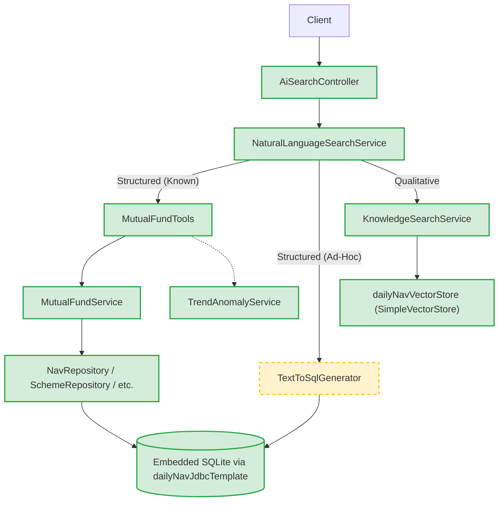
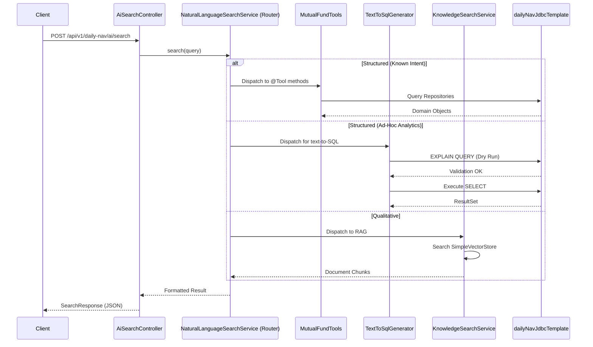

# AI Architecture Proposal: Daily NAV Library

## Overview

This document outlines the strategic AI architecture proposal for the Daily NAV library. Crucially, this architecture is not a greenfield design; it is a direct extension of the existing codebase. It leverages currently established AI features, controllers, and services, enhancing them with routing, evaluation, and dynamic text-to-SQL capabilities. The architecture rigorously respects the library's constraints: zero external network dependencies and a read-only embedded database.

## Component Mapping

Every logical component of the AI architecture maps directly to concrete entities within the existing Java codebase.

*   **Query Intake & Controllers** *(Existing Baseline)*: 
    *   *Implementation*: `AiSearchController` (`POST /api/v1/daily-nav/ai/search`), `KnowledgeSearchController` (`POST /api/v1/daily-nav/ai/ask`), `AiTrendController`, and `PerformanceReportController`.
    *   *State*: Currently relies on manual null/blank string validation and a single `@ExceptionHandler` translating `IllegalStateException` to a 503 HTTP status.
*   **Orchestration & Routing Layer** *(Proposed Extension)*:
    *   *Implementation*: `NaturalLanguageSearchService.search()`
    *   *State*: Currently performs a single-shot execution (`chatClient.prompt().user(query).tools(mutualFundTools).call()`). The proposal extends this method into a robust router, categorizing queries before dispatching them, without introducing heavy new frameworks.
*   **Structured-Data Path** *(Existing)*:
    *   *Implementation*: `MutualFundService` delegating to `NavRepository`, `NavByIsinRepository`, `SchemeRepository`, and `SecurityRepository`.
    *   *State*: Exposed today via the six explicitly defined `@Tool` methods in `MutualFundTools`.
*   **Retrieval Path (RAG)** *(Existing)*:
    *   *Implementation*: `KnowledgeSearchService` + `SimpleVectorStore` (defined as the `dailyNavVectorStore` bean in `DailyNavAiAutoConfiguration`) + `SchemeDocumentIngestionService`.
*   **Analytics** *(Existing)*:
    *   *Implementation*: `TrendAnomalyService` (calculating 200-DMA and optional narratives) is reused as the authoritative source for trend and staleness signals.
*   **LLM Backend** *(Existing)*:
    *   *Implementation*: Local Ollama chat + `mxbai-embed-large` embeddings provided via Spring AI's Ollama starter.
*   **Text-to-SQL Component** *(Proposed New Component)*:
    *   *State*: This schema-grounded, read-only SQL generator is the single genuinely new component in this architecture. It is positioned alongside—not replacing—the existing `MutualFundTools` tool-calling path to handle open-ended analytical queries.

## Architecture Diagrams

### Component Architecture

### Query Execution Sequence

## Constraints

The Daily NAV library operates under stringent environmental constraints that guide this AI architecture:
*   **Opt-In Design**: AI features are strictly gated behind the `daily-nav.ai.enabled=true` property.
*   **Embedded Read-Only Database**: The SQLite database is static and read-only, managed by `DatabaseInitializer` and accessed via `dailyNavJdbcTemplate`. The proposed text-to-SQL component is strictly restricted to `SELECT` statements executed against the known `nav`, `nav_by_isin`, `schemes`, and `securities` schema.

## Routing Workflow

The routing workflow represents a targeted enhancement to `NaturalLanguageSearchService.search()`. Instead of a blind, single-shot LLM call, the service will perform intent classification:

1.  **Structured Intent (NAV/Scheme/Return)**: Standard lookups are routed to the six existing `@Tool` methods in `MutualFundTools`.
2.  **Qualitative Intent (Prospectus/Documents)**: Document inquiries are routed directly to `KnowledgeSearchService`.
3.  **Fallback Path**: Ambiguous queries cleanly gracefully degrade to a safe "outside of financial domain" rejection response.

## Tool-Calling vs. Text-to-SQL

The architecture advocates for a hybrid approach:
*   **Tool-Calling (`MutualFundTools`)**: The existing six `@Tool` methods are highly deterministic. We mandate their use for known, common intents (e.g., fetching the latest NAV of a specific ISIN).
*   **Text-to-SQL**: The proposed text-to-SQL path handles open-ended analytical queries not covered by existing tools (e.g., "Find the top 5 funds by standard deviation in 2024"). We explicitly recommend against replacing `MutualFundTools` with text-to-SQL for basic lookups due to the increased latency and risk.

## SQL Self-Correction and Validation Loop

Currently, `NaturalLanguageSearchService` uses a single-shot `call()` with no retry logic, no input validation inside `MutualFundTools`, and unhandled LLM exceptions. We will address these gaps by wrapping the new text-to-SQL component in a self-correction loop:

1.  **Schema-Grounded Prompt**: The LLM is provided with a strict DDL representation of the SQLite tables.
2.  **Read-Only/SELECT Enforcement**: Generated SQL is parsed to ensure it begins with `SELECT` and contains no mutating keywords.
3.  **Syntactic Validation**: The SQL is validated against the known SQLite schema.
4.  **Dry-Run / EXPLAIN**: Using `dailyNavJdbcTemplate`, the system executes `EXPLAIN QUERY PLAN` to verify syntax and index usage before true execution.
5.  **Bounded Retry**: Execution failures feed the error back to the LLM for correction, up to a defined retry limit.
6.  **Graceful Degradation**: Exhausted retries gracefully fall back to the existing tool-calling mechanism or a polite "unable to answer" response.

## Hallucination-Control Guardrails

To prevent LLM hallucinations, the architecture integrates tightly with existing application behavior:

*   **Staleness Signals**: Reuse `TrendAnomalyService`'s `isStale` signal and 200-DMA output to inform the LLM when historical data is outdated, preventing inaccurate current-day predictions.
*   **Data Absence Protocol**: Require the LLM to refuse answering if the repositories return an empty `Optional` or empty `List` (respecting the current not-found convention in `MutualFundTools`).
*   **Closing the Vector Gap**: Update `KnowledgeSearchService`, which currently queries `SimpleVectorStore` using `topK` with no similarity threshold, to implement a strict distance threshold to prevent fabricating answers from unrelated document chunks.
*   **Result-Set Citation**: Mandate that AI-generated narratives explicitly cite the structured result sets or vector chunks retrieved.
